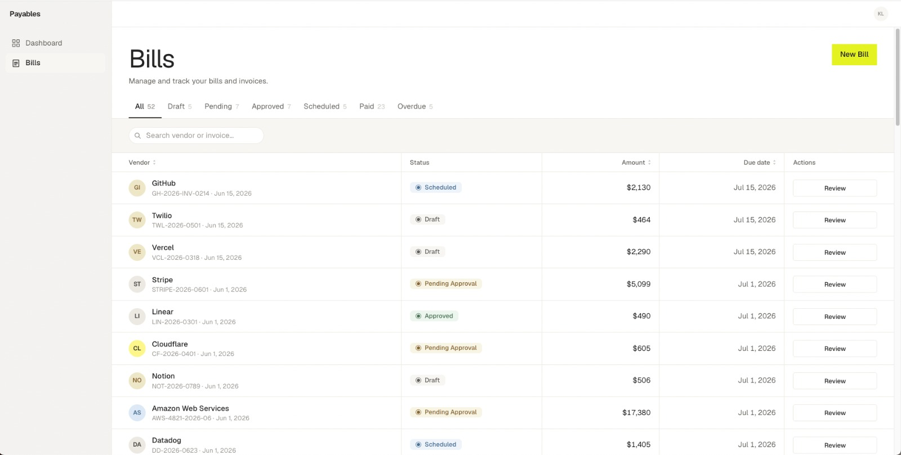
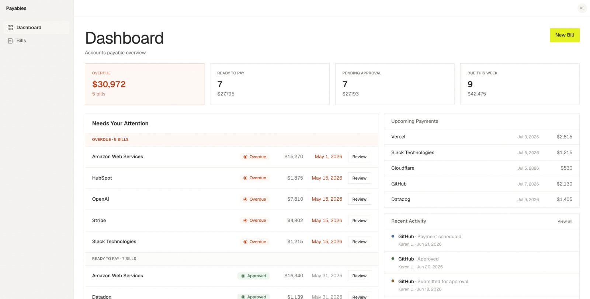
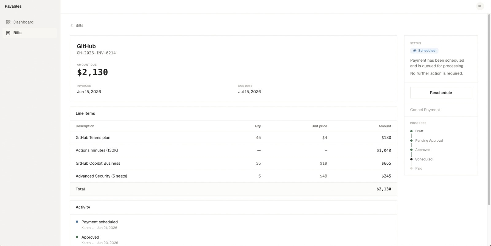
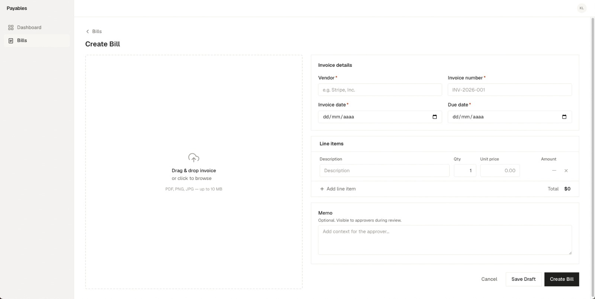

## Payables Platform

A polished Accounts Payable MVP built as a take-home assignment for a Design Engineer role. The goal is product quality and clean engineering rather than feature completeness — a focused tool that reflects how AP specialists actually work, not a feature checklist.

## Live Demo

- **Application:** https://payables-platform.vercel.app
- **Design System:** https://payables-platform.vercel.app/design-system

## Design System

The UI is built on a lightweight internal design system composed of reusable primitives (Button, Badge, FormField, Card, Toast, SearchInput, VendorAvatar, etc.). All application screens consume the same components and design tokens, ensuring consistent spacing, typography, color, accessibility, and interaction patterns.

→ [Explore the Design System](https://payables-platform.vercel.app/design-system)

## Product Overview

The application covers the core AP workflow: receiving invoices, routing them for approval, and tracking payment. Each bill moves through a defined lifecycle:

**Draft → Pending Approval → Approved → Scheduled → Paid**

Overdue is treated as a separate status surfaced by the UI. In production it would be set automatically by a background job that marks past-due bills; in this MVP it is assigned via the seed data.

Every status change writes an activity entry, so the bill detail page shows a coherent audit trail: who created it, who submitted it, who approved it, and when payment was scheduled or confirmed. This is standard in AP tooling because invoices are financial commitments — the timeline matters for audits and vendor disputes.


### Bills




### Dashboard

The dashboard is designed around the questions an AP specialist asks at the start of their day, in priority order:

1. **What is already overdue?** — Overdue bills appear first in Needs Your Attention with a distinct visual treatment. The due date is shown in red to signal that the deadline has passed, not that it is upcoming.
2. **What can I act on right now?** — Approved bills awaiting payment scheduling appear as "Ready to Pay" (KPI card + Needs Attention section).
3. **What payments are going out?** — Upcoming Payments lists all scheduled bills ordered by payment date. This status was otherwise invisible on the dashboard.
4. **What changed recently?** — Recent Activity is filtered to workflow state changes only (submitted, approved, scheduled, paid). Passive events like "Bill created" are excluded so every visible entry represents a meaningful transition.
5. **What is coming up?** — Due This Week counts bills that will need action within seven days, excluding those already scheduled or overdue (which have their own signals).


### Bill Detail

The detail page has a persistent action card that adapts to the bill's current status. Draft bills show "Submit for Approval" and "Edit Bill". Pending bills show "Approve Bill". Approved bills show "Schedule Payment". The lifecycle progress indicator shows where the bill sits in the overall workflow without requiring the specialist to remember status names.

### Create and Edit

The create flow includes an invoice upload step (OCR simulation) that pre-fills vendor, dates, and line items. Line items are entered with quantity and unit price; the total is calculated and stored at submission time using integer arithmetic to avoid floating-point drift on monetary values.

Edit is restricted to Draft bills. Once a bill enters the approval workflow it becomes read-only, which preserves the integrity of the approval record.

## Workflow

The application implements the standard accounts payable lifecycle:

```
Draft
  ↓  specialist submits the invoice for review
Pending Approval
  ↓  approver reviews and authorises payment
Approved
  ↓  payment is scheduled with method and date
Scheduled
  ↓  payment is executed and confirmed
Paid
```

**Overdue** is treated as a separate status rather than a transition. In production it would be set automatically by a scheduled job; in this MVP it is assigned via the seed data and surfaced by the UI without a user-facing action.

## Workflow Simplification

In a production AP platform, invoice creation, approval, and payment execution are typically performed by different users with distinct permissions. An AP clerk enters bills; a finance manager approves them; a treasury team schedules and confirms payments. Each step is gated by role.

This MVP intentionally models the complete lifecycle as a single user to keep the scope focused on workflow logic, UX, and architecture. The product decisions, data model, and state machine are representative of the real business process — only the access-control layer and role separation are omitted.

## Architecture Decisions

**Server Components by default.** Pages fetch data directly from Prisma on the server and pass serialised props to the component tree. There is no API layer between the database and the UI. This eliminates a class of data-fetching bugs, removes round trips, and keeps sensitive query logic off the client.

**Client Components only at interaction boundaries.** The bills table is a Client Component because TanStack Table requires client-side state for sorting and filtering. The action card uses `useTransition` to call Server Actions without blocking the UI. Every component above these boundaries remains server-rendered.

**Server Actions own every mutation.** `createBill`, `updateBill`, `submitForApproval`, and `approveBill` are defined in `app/actions.ts` with `'use server'`. Validation and database writes stay on the server; Next.js handles input serialisation automatically. Each action calls `revalidatePath` so the Bills List, Dashboard, and Bill Detail reflect the change as soon as the client navigates or refreshes.

**Prisma domain model: Vendor → Bill → LineItem + ActivityEntry.** Vendor and Bill are separate entities so multiple invoices from the same vendor share a single record rather than repeating name strings. The `(vendorId, invoiceNumber)` unique constraint prevents duplicate invoice entry. LineItem and ActivityEntry both cascade-delete with their parent Bill.

**ActivityEntry as an append-only audit log.** Rather than storing workflow history as timestamp columns on Bill (e.g. `submittedAt`, `approvedAt`), each state transition writes a new `ActivityEntry` row with a type, label, actor, and timestamp. This makes the timeline extensible — adding a new event type requires no schema change to `Bill` — and produces the activity feed on the detail page and dashboard without a separate query.

**Aggregate queries for dashboard metrics.** The dashboard uses a single `db.bill.groupBy({ by: ['status'], _count, _sum })` to compute all status metrics, and `db.bill.aggregate` with a date-range filter for Due This Week. Loading all bills into memory and computing counts in JavaScript would not scale; the database computes these efficiently with indexed fields.

**Shared form component for Create and Edit.** `BillCreateClient` accepts optional `billId` and `initialValues` props. In edit mode the OCR upload step is hidden, the primary action calls `updateBill`, and cancel returns to the bill detail. No form logic is duplicated. Edit is restricted to Draft bills at the page level — a server-side redirect enforces this before the form renders.

## Tech Stack

| Layer | Technology | Notes |
|---|---|---|
| Framework | Next.js 16 (App Router) | Server Components by default; `'use client'` only at interaction boundaries |
| Language | TypeScript | Strict mode throughout |
| Styling | Tailwind CSS | Custom design tokens; no third-party component library |
| Database | PostgreSQL via Neon | Serverless driver with WebSocket adapter |
| ORM | Prisma 7 | `prisma-client` generator; config in `prisma.config.ts` |
| Table | TanStack Table | Bills list with sorting, filtering, and search |
| Animation | Framer Motion | Subtle interactions only |

Server Actions handle all mutations (`createBill`, `updateBill`, `submitForApproval`, `approveBill`). Each action calls `revalidatePath` on the affected routes; the client navigates after the action completes, so the Bills List, Dashboard, and Bill Detail all reflect the change immediately.

## Getting Started

### Prerequisites

- Node.js 20+
- pnpm
- A [Neon](https://neon.tech) PostgreSQL database

### Setup

```bash
pnpm install
```

Create a `.env` file at the project root:

```env
DATABASE_URL=postgresql://...
```

Apply migrations and generate the Prisma client:

```bash
pnpm exec prisma migrate deploy
pnpm exec prisma generate
```

Seed the database with realistic AP data (13 vendors, 52 bills, activity timelines):

```bash
pnpm exec tsx ./prisma/seed.ts
```

Start the development server:

```bash
pnpm dev
```

Open [http://localhost:3000](http://localhost:3000).

### Available Scripts

| Command | Description |
|---|---|
| `pnpm dev` | Start development server |
| `pnpm build` | Production build with type checking |
| `pnpm exec prisma migrate dev` | Create and apply a new migration |
| `pnpm exec prisma generate` | Regenerate the Prisma client after schema changes |
| `pnpm exec tsx ./prisma/seed.ts` | Clear and re-seed the database |

## Scope

This is an intentionally focused MVP. The following are out of scope and not implemented:

- Authentication and user roles
- Automatic overdue detection (in production a background job would mark past-due bills; here the status is set by the seed)
- Payment scheduling UI (the status exists in the data model; the scheduling action is a placeholder)
- Reject and Request Changes approval actions
- Real OCR (the upload step simulates extraction with mock data)
- Vendor management screens

## Future Improvements

These are deliberate evolutions of the product rather than gaps in the current scope.

**Role-based permissions (RBAC).** Separate clerk, approver, and treasury roles with different capabilities at each workflow stage. The data model and state machine are already structured to support this; the access-control layer is the missing piece.

**Multi-level approval chains.** Approval thresholds by amount, delegated approvals, and escalation rules are common in mid-market AP. The `ActivityEntry` model would extend naturally to record each approver in the chain.

**Real OCR integration.** Replace the simulated upload step with a document parsing service (e.g. AWS Textract, Google Document AI) to extract vendor, dates, and line items from a PDF. The form pre-fill interface is already in place.

**Email invoice ingestion.** Vendors typically send invoices by email. An ingestion pipeline that parses attachments and creates Draft bills automatically would reduce manual data entry significantly.

**Payment execution.** Connect to a payment rail (ACH via Plaid or a bank API, wire transfer) to execute payments from within the platform rather than scheduling them for an external system.

**Vendor management.** A dedicated vendor screen with payment terms, preferred payment method, bank details, and remittance email. Currently vendors are created implicitly when a bill is entered.

**CSV import.** Bulk invoice import for teams migrating from a spreadsheet-based process or integrating with an ERP export.
